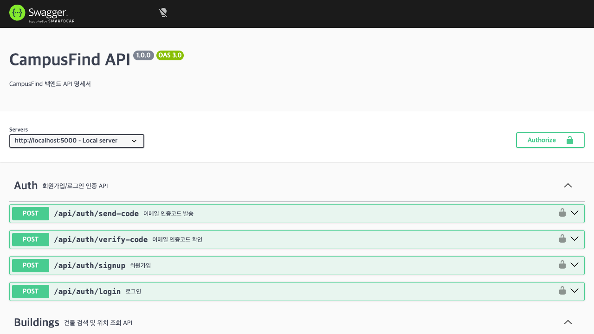
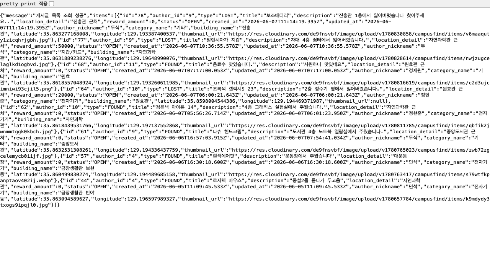
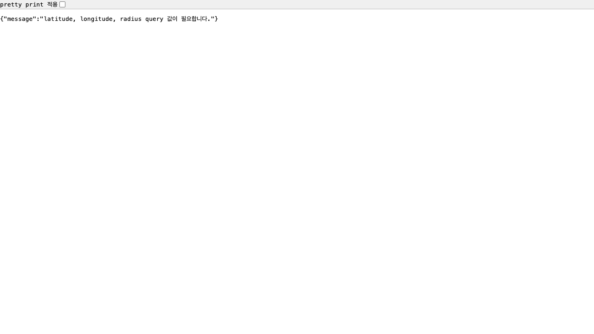
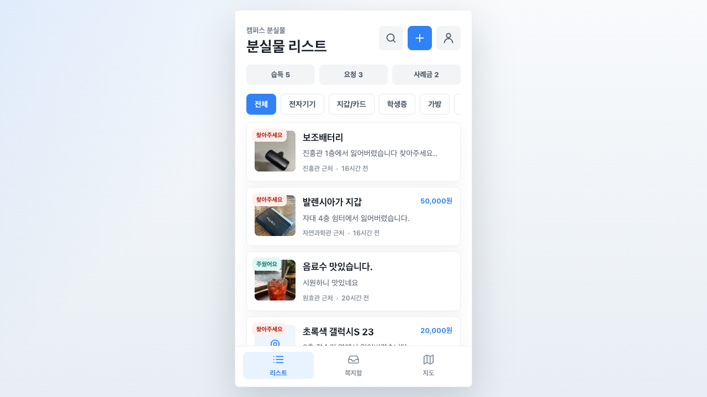
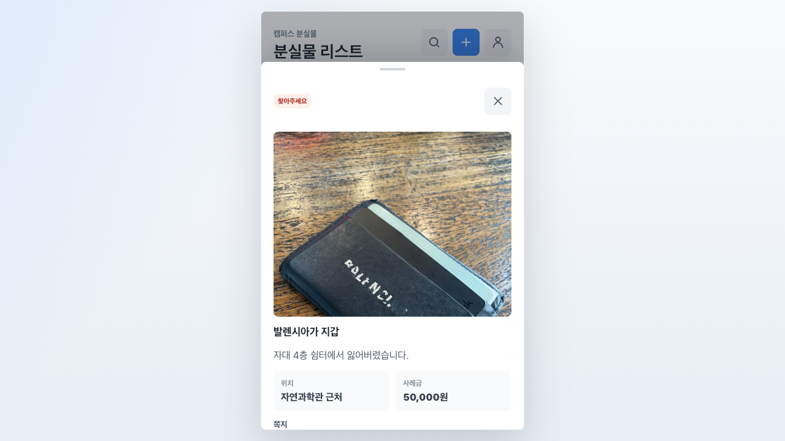
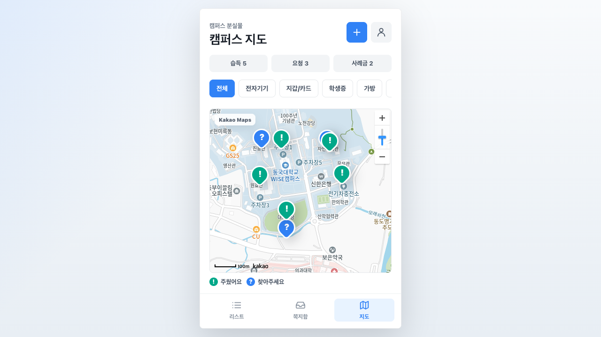
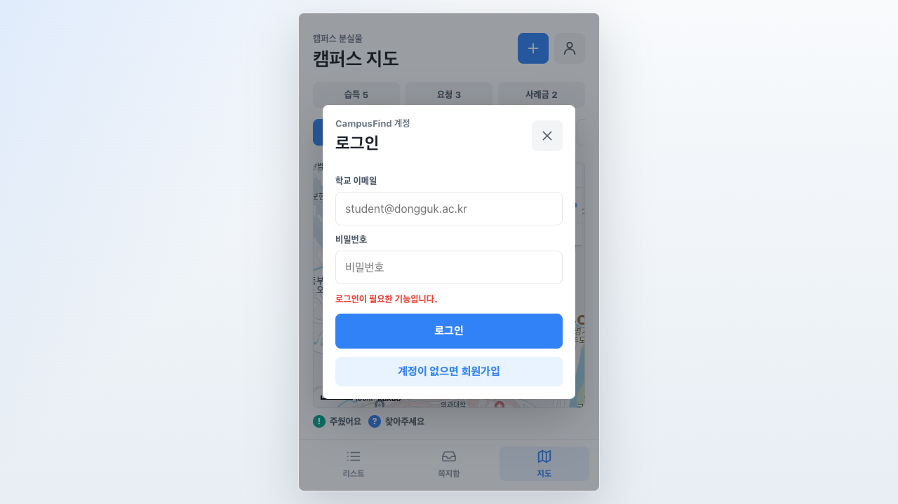
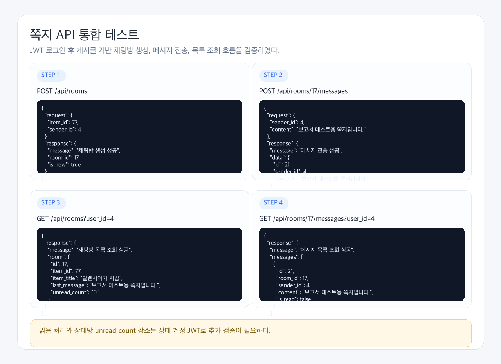
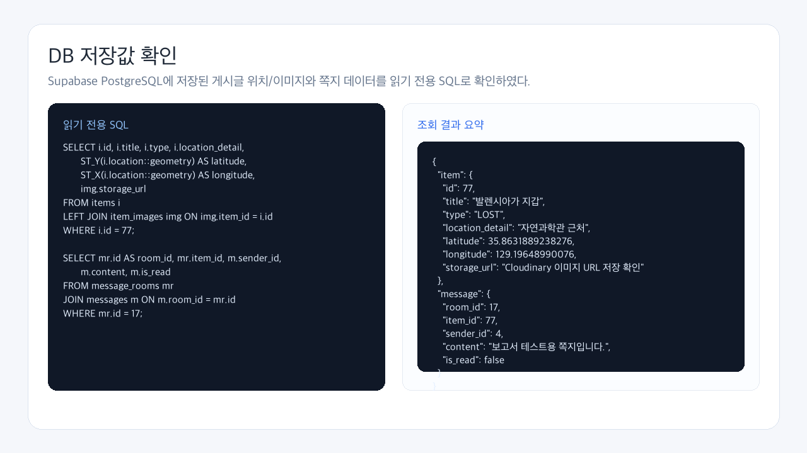

# CampusFind

## 위치 기반 캠퍼스 분실물 찾기 및 보상 시스템

---

## 1. 프로젝트 개요

CampusFind는 캠퍼스 내에서 발생하는 분실물과 습득물을 지도 기반으로 등록하고 검색할 수 있는 커뮤니티 서비스이다.

사용자는 분실물 또는 습득물 게시글을 작성할 때 발견 위치나 분실 위치를 지도에서 선택할 수 있으며, 등록된 게시글은 위치 좌표를 기반으로 저장된다. 이후 사용자는 현재 위치 또는 선택한 위치를 기준으로 일정 반경 안의 게시글을 조회할 수 있다.

또한 이미지 업로드, 건물명 검색, 게시글 조건별 필터링, 1:1 쪽지 기능을 통해 분실자와 습득자가 보다 쉽게 연결될 수 있도록 구성하였다.

본 프로젝트에서는 이미지 자체에 위치 정보를 자동 추출하는 방식이 아니라, 사용자가 지도에서 직접 위치를 선택하거나 건물 검색을 통해 위치를 보정하는 방식을 사용하였다. 이는 실제 사진의 GPS 정보가 삭제되어 있거나 부정확할 수 있기 때문에, 사용자가 직접 확인한 위치를 기준으로 저장하는 방식이 더 안정적이라고 판단했기 때문이다.

---

## 2. 개발 목적

기존 분실물 처리는 학교 커뮤니티 게시판, 단체 채팅방, 오프라인 분실물 센터 등에 흩어져 있어 사용자가 원하는 물건을 찾기 어렵다는 문제가 있다.

CampusFind는 이러한 문제를 해결하기 위해 다음과 같은 목표를 가진다.

- 분실물과 습득물을 지도 위 위치 정보와 함께 등록
- 사용자의 현재 위치 또는 선택 좌표 기준으로 주변 게시글 검색
- 건물명 검색을 통해 위치 선택 편의성 제공
- 이미지 업로드를 통한 물건 식별 정보 제공
- 1:1 쪽지 기능을 통해 분실자와 습득자 연결
- 선택적 사례금 입력을 통해 사용자의 자율적인 보상 의사 표시

---

## 3. 개발 기간 및 역할

### 개발 기간

- 2026.05.06 ~ 2026.06.08

### Backend 역할

- Node.js / Express 기반 REST API 구현
- Supabase PostgreSQL 및 PostGIS 연동
- Cloudinary 이미지 업로드 API 구현
- 게시글 등록, 조회, 수정, 삭제 API 구현
- 위치 기반 반경 검색 API 구현
- 건물 조회 및 건물명 검색 API 구현
- 게시글 조건별 필터링 기능 구현
- Swagger API 문서화
- 테스트 케이스 작성 및 API 검증

### Frontend 역할

- 로그인/회원가입 화면 구현
- 조건별 필터 UI 구현
- React / Vite 기반 화면 구현
- Kakao Maps API 연동
- 지도 클릭을 통한 좌표 선택 기능 구현
- 게시글 작성 및 조회 화면 구현
- API 연동 및 모바일 중심 UI 구성

### Message 역할

- 1:1 채팅방 생성 기능 구현
- 메시지 전송 및 조회 기능 구현
- 안 읽은 메시지 수 조회 기능 구현
- 메시지 읽음 처리 기능 구현
- Polling 기반 메시지 확인 구조 구현

---

## 4. 기술 스택

| 구분 | 기술 |
|---|---|
| Frontend | React, Vite |
| Backend | Node.js, Express |
| Database | Supabase PostgreSQL |
| Spatial Data | PostGIS |
| Image Storage | Cloudinary |
| Map | Kakao Maps API |
| API Docs | Swagger |
| Test Tool | Swagger, Postman, Supabase SQL Editor |
| Version Control | Git, GitHub |

---

## 5. 주요 기능

### 5.1 게시글 기능

- 분실물/습득물 게시글 등록
- 게시글 목록 조회
- 게시글 상세 조회
- 게시글 수정
- 게시글 삭제
- 게시글 상태 관리
  - OPEN: 진행 중
  - MATCHED: 분실자와 습득자 연결
  - RETURNED: 반환 완료

### 5.2 위치 기반 기능

- 지도 클릭을 통한 위치 좌표 선택
- 위도, 경도 기반 게시글 위치 저장
- PostGIS GEOGRAPHY(Point, 4326) 타입 사용
- 현재 위치 또는 선택 좌표 기준 반경 검색
- 거리 계산 후 가까운 순서대로 정렬
- distance_meter 반환

### 5.3 건물 검색 기능

- 건물 전체 목록 조회
- 건물명 키워드 검색
- 특정 건물의 좌표 조회
- 지도 중심 이동 및 위치 선택 보조 기능으로 활용

### 5.4 이미지 업로드 기능

- Cloudinary 기반 이미지 업로드
- 업로드 후 이미지 URL과 public_id 반환
- 이미지 파일은 Cloudinary에 저장
- DB에는 storage_url, public_id, order_index만 저장

### 5.5 게시글 필터링 기능

게시글 목록 조회 API에 조건별 필터링 기능을 추가하였다.

지원하는 필터 조건은 다음과 같다.

- 분실물/습득물 유형
- 게시글 상태
- 카테고리
- 건물
- 키워드 검색
- 사례금 여부

예시:

```txt
GET /api/items?type=LOST&status=OPEN&category_id=2&has_reward=true
```

### 5.6 쪽지 기능

- 게시글 기준 1:1 채팅방 생성
- 동일한 item_id + sender_id 조합의 중복 채팅방 방지
- 메시지 전송
- 메시지 목록 조회
- 내 채팅방 목록 조회
- 안 읽은 메시지 수 조회
- 메시지 읽음 처리

쪽지 기능은 실시간 WebSocket 대신 Polling 방식을 사용하였다.
초기 프로젝트 규모에서는 Polling 방식이 구현 난이도가 낮고 테스트가 쉬우며, 10초 간격으로 확인하면 서버 부하와 사용자 경험 사이의 균형을 맞출 수 있다고 판단하였다.

---

### 5.7 회원가입 및 로그인 기능

- 동국대 이메일(@dongguk.ac.kr)로 이메일 인증 후 회원가입
- 이메일로 6자리 인증코드 발송 (5분 유효)
- 인증코드 확인 후 학번, 닉네임, 비밀번호 입력으로 가입 완료
- bcrypt를 이용한 비밀번호 해싱 저장
- 로그인 성공 시 JWT 토큰 발급 (7일 유효)
- JWT Bearer 토큰 기반 인증으로 게시글 등록/수정/삭제, 쪽지 등 보호 API 접근


---

## 6. 요구사항 분석

### 6.1 기능 요구사항

| 요구사항 | 구현 내용 |
|---|---|
| 위치 기반 게시글 등록 | 지도에서 선택한 위도/경도를 게시글과 함께 저장 |
| 이미지 업로드 | Cloudinary에 이미지 저장 후 URL과 public_id 반환 |
| 위치 기반 검색 | 기준 좌표와 반경을 이용해 주변 게시글 조회 |
| 건물명 검색 | buildings 테이블 기반 건물 검색 및 좌표 반환 |
| 게시글 관리 | 등록, 목록, 상세, 수정, 삭제 API 제공 |
| 조건별 필터링 | 유형, 상태, 카테고리, 건물, 키워드, 사례금 여부 필터링 |
| 1:1 쪽지 | 채팅방 생성, 메시지 전송, 읽음 처리 |
| 사례금 입력 | 게시글 작성 시 선택적으로 reward_amount 저장 |

### 6.2 비기능 요구사항

| 항목 | 내용 |
|---|---|
| 데이터 무결성 | 외래키 기반 users, categories, buildings, items 관계 유지 |
| 위치 정확성 | PostGIS를 이용한 거리 계산 및 반경 검색 |
| 확장성 | 추후 인증, 알림 서버, 실시간 메시지 기능으로 확장 가능 |
| API 문서화 | Swagger를 통해 API 테스트 및 명세 확인 가능 |
| 이미지 저장 안정성 | 이미지 파일은 Cloudinary, 메타데이터는 DB에 분리 저장 |

---

## 7. 시스템 구조

CampusFind는 프론트엔드, 백엔드 서버, 데이터베이스, 이미지 스토리지, 지도 API로 구성된다.

```txt
React Frontend
  |
  | REST API 요청
  v
Node.js / Express Backend
  |
  | SQL Query
  v
Supabase PostgreSQL + PostGIS

이미지 업로드:
React Frontend -> Express Backend -> Cloudinary

지도 기능:
React Frontend -> Kakao Maps API
```


---

## 8. 데이터베이스 설계

### 8.1 users

사용자 정보를 저장하는 테이블이다.

| 컬럼 | 설명 |
|---|---|
| id | 사용자 ID |
| email | 이메일 |
| student_id | 학번 |
| password_hash | 비밀번호 해시 |
| nickname | 닉네임 |
| email_verified | 이메일 인증 여부 |
| is_active | 활성 상태 |
| created_at | 생성일 |
| updated_at | 수정일 |

### 8.2 categories

분실물/습득물 카테고리를 저장하는 테이블이다.

| 컬럼 | 설명 |
|---|---|
| id | 카테고리 ID |
| name | 카테고리명 |

예시 카테고리:

```txt
지갑/카드
전자기기
의류
가방
기타
```

### 8.3 buildings

캠퍼스 건물 정보를 저장하는 테이블이다.

| 컬럼 | 설명 |
|---|---|
| id | 건물 ID |
| name | 건물명 |
| latitude | 위도 |
| longitude | 경도 |

건물 검색 API는 외부 Geocoding API 대신 이 테이블을 기준으로 동작한다.

### 8.4 items

분실물/습득물 게시글 정보를 저장하는 핵심 테이블이다.

| 컬럼 | 설명 |
|---|---|
| id | 게시글 ID |
| author_id | 작성자 ID |
| category_id | 카테고리 ID |
| building_id | 건물 ID |
| type | LOST 또는 FOUND |
| title | 제목 |
| description | 설명 |
| location_detail | 상세 위치 |
| location | PostGIS 위치 좌표 |
| reward_amount | 사례금 |
| status | 게시글 상태 |
| created_at | 생성일 |
| updated_at | 수정일 |

위치 정보는 다음과 같은 형식으로 저장한다.

```sql
POINT(longitude latitude)
```

프론트에서 전달하는 값은 latitude, longitude 순서이지만, PostGIS에 저장할 때는 반드시 longitude latitude 순서로 변환한다.

### 8.5 item_images

게시글 이미지 정보를 저장하는 테이블이다.

| 컬럼 | 설명 |
|---|---|
| id | 이미지 ID |
| item_id | 게시글 ID |
| storage_url | Cloudinary 이미지 URL |
| public_id | Cloudinary public_id |
| order_index | 이미지 순서 |
| created_at | 생성일 |

### 8.6 message_rooms

1:1 쪽지방 정보를 저장하는 테이블이다.

| 컬럼 | 설명 |
|---|---|
| id | 채팅방 ID |
| item_id | 게시글 ID |
| author_id | 게시글 작성자 ID |
| contact_id | 문의 사용자 ID |
| last_message_at | 마지막 메시지 시간 |
| created_at | 생성일 |

### 8.7 messages

쪽지 메시지를 저장하는 테이블이다.

| 컬럼 | 설명 |
|---|---|
| id | 메시지 ID |
| room_id | 채팅방 ID |
| sender_id | 보낸 사용자 ID |
| content | 메시지 내용 |
| is_read | 읽음 여부 |
| created_at | 생성일 |


---

## 9. API 명세

### 9.1 Image API

| Method | URL | 설명 |
|---|---|---|
| POST | /api/images/upload | 이미지 업로드 |

### 9.2 Item API

| Method | URL | 설명 |
|---|---|---|
| POST | /api/items | 게시글 등록 |
| GET | /api/items | 게시글 목록 조회 및 조건별 필터링 |
| GET | /api/items/nearby | 위치 기반 반경 검색 |
| GET | /api/items/{id} | 게시글 상세 조회 |
| PATCH | /api/items/{id} | 게시글 수정 |
| DELETE | /api/items/{id} | 게시글 삭제 |

### 9.3 Building API

| Method | URL | 설명 |
|---|---|---|
| GET | /api/buildings | 건물 전체 조회 |
| GET | /api/buildings/search | 건물명 검색 |
| GET | /api/buildings/{id}/location | 건물 좌표 조회 |

### 9.4 Message API

| Method | URL | 설명 |
|---|---|---|
| POST | /api/rooms | 채팅방 생성 |
| GET | /api/rooms | 내 채팅방 목록 조회 |
| GET | /api/rooms/unread-count | 전체 안 읽은 메시지 수 조회 |
| GET | /api/rooms/{id}/messages | 메시지 목록 조회 |
| POST | /api/rooms/{id}/messages | 메시지 전송 |
| PUT | /api/rooms/{id}/read | 메시지 읽음 처리 |


---

### 9.5 Auth API

| Method | URL | 설명 |
|---|---|---|
| POST | /api/auth/send-code | 이메일 인증코드 발송 |
| POST | /api/auth/verify-code | 인증코드 확인 |
| POST | /api/auth/signup | 회원가입 |
| POST | /api/auth/login | 로그인 |

---

## 10. 구현 내용

### 10.1 Cloudinary 이미지 업로드

이미지 업로드 API는 multipart/form-data 형식으로 이미지를 받아 Cloudinary에 저장한다.

업로드 성공 시 백엔드는 다음 정보를 반환한다.

```json
{
  "storage_url": "https://res.cloudinary.com/...",
  "public_id": "campusfind/items/...",
  "order_index": 0
}
```

반환된 이미지 정보는 게시글 등록 시 images 배열에 포함하여 item_images 테이블에 저장한다.


[사진 필요: Cloudinary Media Library 저장 확인 화면]

---

### 10.2 게시글 등록 및 위치 저장

게시글 등록 API는 게시글 정보, 이미지 정보, 위치 좌표를 함께 저장한다.

프론트에서 전달하는 위치 데이터:

```json
{
  "latitude": 35.861837,
  "longitude": 129.193553
}
```

백엔드 저장 방식:

```sql
ST_GeogFromText('POINT(129.193553 35.861837)')
```

이를 통해 DB에는 PostGIS GEOGRAPHY(Point, 4326) 형식으로 위치가 저장된다.

[사진 필요: 게시글 등록 요청 화면]
[사진 필요: 게시글 등록 성공 응답 화면]


---

### 10.3 위치 기반 반경 검색

위치 기반 반경 검색 API는 기준 좌표와 반경을 query parameter로 전달받아 반경 안에 있는 게시글을 조회한다.

요청 예시:

```txt
GET /api/items/nearby?latitude=35.861837&longitude=129.193553&radius=500
```

핵심 PostGIS 함수:

```sql
ST_DWithin(location, 기준좌표, radius)
ST_Distance(location, 기준좌표)
```

조회 결과에는 기준 좌표로부터의 거리인 distance_meter를 포함하며, 거리순으로 정렬된다.

[사진 필요: nearby API 요청 화면]
[사진 필요: distance_meter가 포함된 응답 화면]

---

### 10.4 건물 검색 및 좌표 조회

건물 API는 외부 Geocoding API 대신 내부 buildings 테이블을 활용한다.

사용자는 건물명을 검색하여 건물 좌표를 조회할 수 있고, 프론트에서는 해당 좌표로 지도 중심을 이동시킬 수 있다.

예시:

```txt
GET /api/buildings/search?keyword=원효관
GET /api/buildings/8/location
```


---

### 10.5 게시글 조건별 필터링

기존 게시글 목록 조회 API에 query parameter를 추가하여 조건별 필터링이 가능하도록 구현하였다.

기본 요청:

```txt
GET /api/items
```

필터 요청:

```txt
GET /api/items?type=LOST
GET /api/items?status=OPEN
GET /api/items?category_id=2
GET /api/items?building_id=8
GET /api/items?keyword=에어팟
GET /api/items?has_reward=true
```

복합 조건 요청:

```txt
GET /api/items?type=LOST&status=OPEN&category_id=2&building_id=8&has_reward=true
```

아무 조건도 입력하지 않으면 전체 게시글을 조회하고, 조건이 입력되면 해당 조건을 만족하는 게시글만 반환한다.


---

### 10.6 게시글 수정 및 삭제

게시글 수정 API는 작성자 확인 후 제목, 설명, 위치, 사례금, 상태 등을 수정할 수 있도록 구현하였다.

게시글 삭제 API는 작성자 확인 후 게시글과 연결된 이미지 정보를 삭제한다.

요청 예시:

```txt
PATCH /api/items/{id}
DELETE /api/items/{id}
```

<table>
  <tr align="center">
    <td><b>게시글 수정 전</b></td>
    <td><b>게시글 수정 후</b></td>
    <td><b>게시글 등록</b></td>
    <td><b>게시글 삭제</b></td>
  </tr>
  <tr align="center">
    <td></td>
    <td></td>
    <td></td>
    <td></td>
  </tr>
</table>

---

### 10.7 1:1 쪽지 기능

쪽지 기능은 게시글을 기준으로 분실자와 습득자가 대화할 수 있도록 구현하였다.

채팅방 생성 시 동일한 item_id + sender_id 조합이 이미 존재하면 새로운 방을 만들지 않고 기존 채팅방을 반환한다. 이를 통해 중복 채팅방 생성을 방지하였다.

메시지 전송 후에는 message_rooms.last_message_at 값을 갱신하여 채팅방 목록을 최신 메시지 순으로 정렬할 수 있도록 하였다.

또한 Polling 기반으로 안 읽은 메시지 수를 조회할 수 있도록 구현하였다.

[사진 필요: 채팅방 생성 API 화면]
[사진 필요: 메시지 전송 API 화면]
[사진 필요: 메시지 목록 조회 API 화면]
[사진 필요: 안 읽은 메시지 수 조회 API 화면]
[사진 필요: 메시지 읽음 처리 API 화면]

---

### 10.8 회원가입 및 로그인

회원가입은 이메일 인증, 인증코드 확인, 정보 입력의 3단계로 구성하였다.

**회원가입 흐름:**

```txt
1. POST /api/auth/send-code {email}
   → 동국대 이메일(@dongguk.ac.kr) 검증 후 6자리 인증코드 발송 (5분 유효)

2. POST /api/auth/verify-code {email, code}
   → 인증코드 일치 여부 확인, 통과 시 인증 완료 상태 저장 (10분 유효)

3. POST /api/auth/signup {email, password, nickname, student_id}
   → 이메일 인증 완료 여부 확인
   → 이메일, 학번, 닉네임 중복 확인
   → bcrypt로 비밀번호 해싱 후 users 테이블에 저장
   → JWT 토큰 발급 (7일 유효)
```


**로그인 흐름:**

```txt
1. POST /api/auth/login {email, password}
   → users 테이블에서 이메일로 사용자 조회
   → bcrypt.compare로 비밀번호 검증
   → JWT 토큰 발급 (7일 유효)
```


**보호 API 접근:**

로그인 후 발급된 JWT 토큰을 Authorization 헤더에 포함하여 요청한다.

```txt
Authorization: Bearer {token}
```

게시글 등록/수정/삭제, 이미지 업로드, 쪽지 기능은 토큰 검증 미들웨어를 통해 인증된 사용자만 접근할 수 있다.

---

### 10.9 이메일 인증 서비스 구현

이메일 인증코드는 외부 DB 대신 서버 인메모리 Map으로 관리하였다.

두 개의 Map을 사용한다.

| Map | 키 | 값 | 유효 시간 |
|---|---|---|---|
| verificationCodes | email | { code, expiresAt } | 5분 |
| verifiedEmails | email | expiresAt | 10분 |

**처리 흐름:**

```txt
1. 인증코드 요청 (send-code)
   → 6자리 난수 생성
   → verificationCodes Map에 저장 (5분 유효)
   → Gmail SMTP로 인증코드 발송

2. 인증코드 확인 (verify-code)
   → verificationCodes에서 코드 조회
   → 만료 여부 및 일치 여부 확인
   → 통과 시 verificationCodes에서 삭제
   → verifiedEmails Map에 저장 (10분 유효)

3. 회원가입 (signup)
   → consumeVerifiedEmail 호출
   → verifiedEmails에 해당 이메일이 있으면 삭제 후 true 반환
   → 없거나 만료된 경우 false 반환 → 400 오류
```

인메모리 방식이므로 서버 재시작 시 인증 상태가 초기화된다. 현재 프로젝트 규모에서는 별도 Redis 등 외부 저장소 없이 간단하게 처리하였다.

<table>
  <tr align="center">
    <td><b>회원가입 시 학교 이메일 인증</b></td>
    <td><b>이메일 인증 번호 전송</b></td>
  </tr>
  <tr align="center">
    <td width="50%"></td>
    <td width="50%"></td>
  </tr>
</table>

---

## 11. 테스트 계획 및 검증

### 11.1 테스트 방식

본 프로젝트는 REST API 기반 서비스이므로 블랙박스 테스트를 중심으로 진행하였다.

블랙박스 테스트는 내부 코드 구조를 직접 확인하지 않고, API 요청값과 응답 결과를 기준으로 기능이 정상 동작하는지 확인하는 방식이다. CampusFind의 게시글 등록, 이미지 업로드, 위치 기반 검색, 건물 검색, 쪽지 기능은 사용자의 요청과 응답 결과가 중요하므로 블랙박스 테스트가 적합하다.

다만 위치 좌표 저장, 이미지 URL 저장, 메시지 읽음 처리처럼 DB 저장 구조가 중요한 기능은 Supabase SQL Editor를 통해 실제 저장 결과를 확인하였다. 이는 내부 데이터 상태를 확인하는 과정이므로 화이트박스 관점의 검증을 일부 병행하였다.

| 테스트 종류 | 적용 범위 | 선정 이유 |
|---|---|---|
| 블랙박스 테스트 | API 요청 및 응답 검증 | 사용자 관점에서 기능 정상 동작 여부 확인 |
| 화이트박스 테스트 | DB 저장값 확인 | 위치 좌표, 이미지 URL, 메시지 읽음 처리 확인 필요 |
| 예외 테스트 | 잘못된 입력값 검증 | 필수값 누락, 잘못된 query 값 처리 확인 |
| 통합 테스트 | API 간 흐름 검증 | 실제 서비스 사용 흐름 확인 |

---

### 11.2 주요 테스트 항목

| 테스트 ID | 테스트 항목 | 검증 내용 | 예상 결과 |
|---|---|---|---|
| TC-ITEM-01 | 게시글 등록 | 게시글, 위치, 이미지 정보 저장 | 201 응답 및 DB 저장 |
| TC-ITEM-02 | 게시글 목록 조회 | 전체 게시글 목록 반환 | 200 응답 |
| TC-ITEM-03 | 게시글 상세 조회 | 특정 게시글 상세 정보와 이미지 목록 반환 | 200 응답 |
| TC-ITEM-04 | 게시글 수정 | 작성자 확인 후 게시글 수정 | 200 응답 |
| TC-ITEM-05 | 게시글 삭제 | 작성자 확인 후 게시글 삭제 | 200 응답 |
| TC-IMG-01 | 이미지 업로드 | Cloudinary 저장 및 URL 반환 | 201 응답 |
| TC-LOC-01 | 위치 기반 반경 검색 | 반경 안 게시글 거리순 조회 | distance_meter 반환 |
| TC-BUILDING-01 | 건물명 검색 | 키워드 기반 건물 조회 | 건물 좌표 반환 |
| TC-FILTER-01 | 조건별 필터링 | 유형, 상태, 카테고리, 키워드 조건 적용 | 조건에 맞는 게시글 반환 |
| TC-MSG-01 | 채팅방 생성 | 게시글 기준 채팅방 생성 | room_id 반환 |
| TC-MSG-02 | 메시지 전송 | 메시지 저장 및 last_message_at 갱신 | 201 응답 |
| TC-MSG-03 | 읽음 처리 | 받은 메시지 읽음 상태 변경 | unread_count 감소 |

---

### 11.3 예외 테스트 항목

| 테스트 항목 | 입력 예시 | 예상 결과 |
|---|---|---|
| 게시글 등록 필수값 누락 | latitude 없음 | 400 응답 |
| 잘못된 위치 좌표 | latitude=abc | 400 응답 |
| 잘못된 검색 반경 | radius=-100 | 400 응답 |
| 잘못된 게시글 유형 | type=ABC | 400 응답 |
| 잘못된 게시글 상태 | status=DONE | 400 응답 |
| 존재하지 않는 게시글 조회 | GET /api/items/999999 | 404 응답 |
| 작성자가 아닌 사용자 수정 | author_id 불일치 | 권한 오류 응답 |
| 작성자가 아닌 사용자 삭제 | author_id 불일치 | 권한 오류 응답 |

[사진 필요: 대표 정상 테스트 Swagger 화면]
[사진 필요: 대표 예외 테스트 400 응답 화면]
[사진 필요: Supabase SQL Editor DB 확인 화면]

#### 대표 테스트 캡처



Swagger UI를 통해 게시글, 이미지, 위치, 건물, 쪽지 관련 REST API 목록을 확인하였다. API 문서 화면에서는 각 endpoint의 요청 방식과 파라미터, 응답 형식을 확인할 수 있어 기능별 테스트의 기준으로 활용하였다.



게시글 목록 조회 API를 직접 호출하여 등록된 게시글 목록이 JSON 형태로 정상 반환되는지 확인하였다. 응답에는 게시글 ID, 작성자 ID, 게시글 유형, 제목, 위치 상세 정보, 건물명, 좌표, 이미지 썸네일 URL 등이 포함되어 프론트엔드 목록 화면과 지도 화면에 필요한 데이터가 전달됨을 검증하였다.



위치 기반 nearby API 호출 시 필수 query 값인 latitude, longitude, radius를 전달하지 않은 경우 400 응답이 반환되는지 확인하였다. 이를 통해 잘못된 요청에 대해 서버가 정상적으로 예외 응답을 반환함을 검증하였다.



프론트엔드 게시글 목록 화면에서는 API 응답으로 받은 분실물/습득물 게시글이 카드 형태로 표시되는지 확인하였다. 이미지가 있는 게시글은 썸네일이 표시되고, 요청 게시글은 사례금 정보가 함께 노출되는지 검증하였다.



이미지가 첨부된 '찾아주세요' 게시글을 상세 화면에서 열어 이미지, 위치, 사례금, 설명 정보가 함께 표시되는지 확인하였다. 이를 통해 이미지 업로드 결과가 게시글 상세 조회 흐름에서도 활용됨을 검증하였다.



지도 화면에서는 등록된 게시글의 좌표를 기반으로 마커가 표시되는지 확인하였다. 습득 게시글은 느낌표, 요청 게시글은 물음표 마커로 구분되며, 지도 위에서 게시글 유형을 시각적으로 구분할 수 있음을 검증하였다.



게시글 등록 기능은 로그인 후 사용할 수 있도록 제한되어 있다. 비로그인 상태에서 게시글 등록 버튼을 누르면 로그인 모달이 표시되는지 확인하여 인증이 필요한 기능에 접근 제어가 적용됨을 검증하였다.



JWT 로그인 후 게시글 상세 화면에서 사용할 쪽지 API 흐름을 검증하였다. 게시글 ID와 발신자 ID를 기반으로 채팅방을 생성하고, 생성된 room_id로 메시지를 전송한 뒤 채팅방 목록과 메시지 목록에서 마지막 메시지 및 메시지 본문이 조회되는지 확인하였다.



Supabase PostgreSQL에 저장된 게시글 위치, 이미지 URL, 쪽지 데이터를 읽기 전용 SQL로 확인하였다. 게시글 좌표는 PostGIS location 값에서 ST_Y, ST_X로 조회되며, item_images에는 Cloudinary 이미지 URL이 저장되고 message_rooms와 messages에는 채팅방 및 메시지 내용이 저장되는 것을 확인하였다.

---

### 11.4 통합 테스트 시나리오

#### 시나리오 1. 이미지 업로드 후 게시글 등록

```txt
1. 이미지 업로드 API 호출
2. Cloudinary에 이미지 저장
3. storage_url, public_id 반환
4. 게시글 등록 API에 이미지 정보와 위치 좌표 포함
5. items 테이블에 게시글 저장
6. item_images 테이블에 이미지 정보 저장
7. 게시글 상세 조회로 등록 결과 확인
```

검증 결과, 이미지가 첨부된 게시글은 목록 화면에서 썸네일로 표시되고 상세 화면에서 원본 이미지 영역으로 표시되었다. API 응답에는 thumbnail_url이 포함되어 프론트엔드에서 이미지 URL을 정상적으로 매핑할 수 있음을 확인하였다.

관련 캡처:
- report-assets/test-screenshots/01-list-view.png
- report-assets/test-screenshots/02-request-detail-image.png
- report-assets/test-screenshots/06-items-api-response.png
- report-assets/test-screenshots/09-db-verification.png

#### 시나리오 2. 위치 기반 게시글 검색

```txt
1. 사용자가 지도에서 기준 위치 선택
2. latitude, longitude, radius를 nearby API에 전달
3. PostGIS로 반경 안 게시글 조회
4. distance_meter 기준 거리순 정렬
5. 지도 마커 표시용 좌표 반환
```

검증 결과, 지도 화면에서 게시글 유형에 따라 서로 다른 마커가 표시되었고, API 응답의 latitude, longitude, building_name, location_detail 값이 프론트엔드 지도 표시와 게시글 상세 위치 표시의 기준으로 사용됨을 확인하였다. nearby API의 필수 좌표 값이 누락된 경우에는 400 응답이 반환되어 예외 처리도 동작하였다.

관련 캡처:
- report-assets/test-screenshots/03-map-markers.png
- report-assets/test-screenshots/07-nearby-400-response.png

#### 시나리오 3. 게시글 기반 쪽지 흐름

```txt
1. 게시글 상세 화면에서 채팅방 생성
2. 메시지 전송
3. 메시지 목록 조회
4. 안 읽은 메시지 수 조회
5. 채팅방 입장 시 읽음 처리
6. unread_count 감소 확인
```

검증 결과, JWT 로그인 후 게시글 ID와 사용자 ID를 이용해 채팅방을 생성할 수 있었고, 생성된 room_id로 메시지를 전송할 수 있었다. 이후 내 채팅방 목록 조회 API에서 해당 게시글 제목, 상대방 닉네임, 마지막 메시지가 반환되었으며, 메시지 목록 조회 API에서도 전송한 메시지 본문과 읽음 상태가 확인되었다.

읽음 처리와 상대방 unread_count 감소는 상대방 계정으로 로그인한 뒤 확인해야 하는 항목이다. 따라서 현재 검증에서는 채팅방 생성, 메시지 전송, 내 채팅방 목록 조회, 메시지 목록 조회까지 확인하였고, 최종 발표 전에는 상대 계정 JWT로 읽음 처리 API를 추가 확인하는 것이 필요하다.

관련 캡처:
- report-assets/test-screenshots/08-message-api-flow.png
- report-assets/test-screenshots/09-db-verification.png

---

## 12. 문제 해결 및 고려 사항

### 12.1 Supabase Direct Connection 문제

Supabase PostgreSQL 연결 시 Direct Connection 방식에서 IPv4 관련 문제가 발생하였다.
이를 해결하기 위해 Supabase Session Pooler 방식의 DATABASE_URL을 사용하여 백엔드와 DB를 연결하였다.

### 12.2 PostGIS 좌표 저장 순서

프론트에서는 일반적으로 latitude, longitude 순서로 좌표를 다루지만, PostGIS POINT는 longitude latitude 순서로 저장해야 한다.

따라서 백엔드에서 다음과 같이 변환하여 저장하였다.

```sql
POINT(longitude latitude)
```

### 12.3 이미지 저장 방식

이미지 파일 자체를 DB에 저장하지 않고 Cloudinary에 저장하였다.
DB에는 이미지 접근에 필요한 storage_url, public_id만 저장하여 DB 용량 부담을 줄이고 이미지 관리 효율성을 높였다.

### 12.4 이미지 위치 자동 추출 제외

사진의 EXIF GPS 정보를 이용해 위치를 자동으로 추출하는 방식도 고려할 수 있으나, 실제로는 카카오톡이나 메신저를 거친 이미지에서 GPS 정보가 삭제되는 경우가 많다.

따라서 본 프로젝트에서는 이미지 위치 자동 추출 대신 사용자가 지도에서 위치를 직접 선택하거나 건물 검색을 통해 위치를 보정하는 방식을 사용하였다.

### 12.5 이미지 태그 인식 대체

초기 요구사항에는 이미지 태그 인식이 포함되어 있었으나, 프로젝트 범위와 구현 안정성을 고려하여 AI 기반 이미지 인식 대신 카테고리 선택 방식으로 대체하였다.

사용자는 게시글 작성 시 지갑/카드, 전자기기 등 카테고리를 직접 선택하며, 이를 기반으로 게시글을 분류하고 필터링할 수 있다.

### 12.6 사례금 매칭 방식

사례금은 시스템이 자동으로 매칭하거나 정산하지 않는다.
사용자가 게시글 작성 시 선택적으로 희망 사례금 금액을 입력하고, 이후 분실자와 습득자가 쪽지를 통해 직접 협의하는 방식으로 설계하였다.

---

## 13. 프로젝트 결과

CampusFind는 캠퍼스 내 분실물과 습득물을 위치 기반으로 등록하고 조회할 수 있는 서비스이다.

본 프로젝트를 통해 다음 기능을 구현하였다.

- Cloudinary 이미지 업로드
- 게시글 등록, 조회, 수정, 삭제
- PostGIS 기반 위치 저장
- 위치 기반 반경 검색
- 건물명 검색 및 건물 좌표 조회
- 게시글 조건별 필터링
- 선택적 사례금 입력
- 1:1 쪽지 및 안 읽은 메시지 확인
- Swagger API 문서화

이를 통해 사용자는 단순 게시판이 아니라 지도와 위치 정보를 기반으로 분실물과 습득물을 확인할 수 있으며, 쪽지 기능을 통해 상대방과 직접 연락할 수 있다.

---

## 14. 향후 개선 방향

- 프론트엔드 게시글 작성 화면과 API 연동 고도화
- 지도 위 주변 게시글 마커 표시
- 사용자 인증 및 JWT 기반 권한 검증 강화
- 게시글 삭제 시 관련 쪽지방 처리 정책 정리
- 실시간 알림을 위한 Socket.IO 또는 SSE 도입 검토
- 모바일 환경 GPS 정확도 테스트
- 이미지 EXIF GPS 자동 추천 기능 검토
- 관리자 페이지 및 신고 기능 추가 검토

---

## 15. 결론

CampusFind는 캠퍼스라는 제한된 공간에서 분실물과 습득물을 효율적으로 찾기 위한 위치 기반 서비스이다.

지도 기반 위치 선택, PostGIS 거리 검색, Cloudinary 이미지 업로드, 건물 검색, 조건별 필터링, 1:1 쪽지 기능을 통해 분실자와 습득자가 더 쉽게 연결될 수 있도록 구현하였다.

특히 위치 정보는 단순 텍스트 설명이 아니라 실제 좌표로 저장되기 때문에, 사용자는 주변 게시글을 거리순으로 확인할 수 있다. 또한 이미지와 카테고리, 사례금 정보를 함께 제공하여 게시글의 식별성과 활용성을 높였다.

본 프로젝트는 위치 기반 게시글 등록과 검색이라는 핵심 요구사항을 중심으로 구현되었으며, 추후 프론트엔드 고도화와 실시간 알림 기능을 추가하면 실제 서비스 수준으로 확장할 수 있다.
